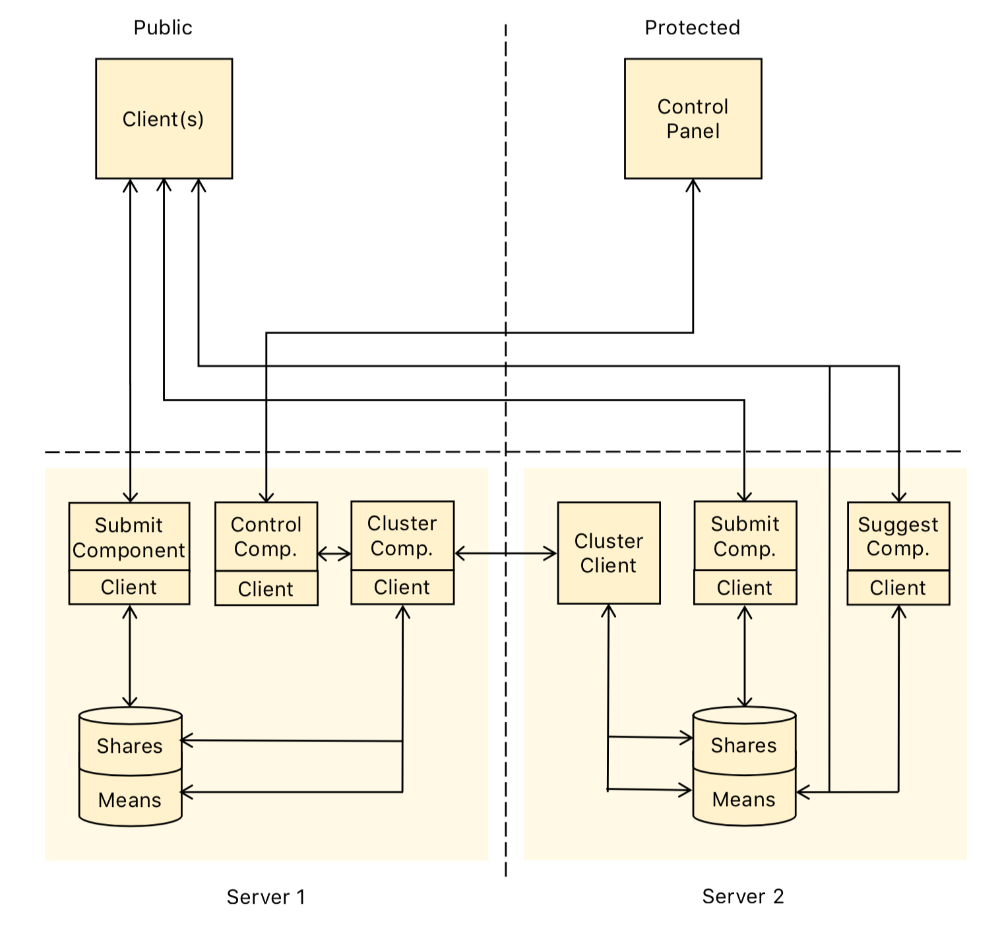

# User Privacy Preferences
Prototype application that allows users to receive privacy profile policy/configuration recommendations in a privacy-preserving way.

## Installation

The client and server side mpc is written entirely in JavaScript.  Running the server requires [Node](https://nodejs.org/en/), [npm](https://www.npmjs.com/) and [the JIFF Library](https://github.com/multiparty/jiff).

Run npm to install JIFF inside the `jiff` directory:
```shell
npm install --prefix jiff
```

## Project Layout

    ├─ jiff/          Alias to JIFF library dependency
    ├─ server1/       Main clustering server root
    │  └─ public/       Web directory for hosting the server control panel
    ├─ server1/       Secondary clustering server root
    │  └─ public/       Web directory for user preference interface

## Running the Prototype

### As a Server
Start each server from its directory with the command:
```shell
node server1/server.js  # Server 1 (and control panel)
node server1/server.js  # Server 2 (and preference UI)
```

### As a User
Users can go to `http(s)://server2address:80/client.html` in a web browser supporting JavaScript to input and receive recommendations.
Recommendations are updated on a manual time basis by going to `http(s)://server1address:81/controls.html` and telling the main clustering server to begin clustering.

## Network Architecture Diagram


